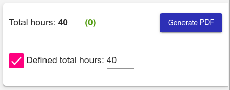

# AngularContractHours

Life version demo: https://jurek2006.github.io/angular-contract-hours/

As a regular Angular project you can download/clone the repository, install dependencies (`npm install` ) and run a dev server (`ng serve`) then navigate to `http://localhost:4200/`

## Table of contents

- [About AngularContractHours](#about)
- [Problem to solve](#problem-to-solve)
- [Manual: How to use the app](#manual)
- [Technologies used](#technologies)
- [Known issues](#known-issues)
- [Future plans for improvement](#future-plans)
- [Info for developers](#for-developers)

## About AngularContractHours

AngularContractHours helps **reporting contractor's working hours** and **generate monthly working schedule in printable PDF.** (It is useful when working in Poland under the type of contract which is called "umowa zlecenie").

The application is in English, but some parts are provided in Polish (as dates and report template), because I suppose it's useful only in "polish reality" (Let me know if it can be useful for you after some changes).

**The application is responsive** - it changes slightly its appearance and behavior on mobile (smaller) screens to remain useful. (At the moment, it is still cumbersome to use it on small mobile screens in landscape orientation when screen keyboard is opened [see issues on Github]).

## Problem to solve

The main reason for the project was (and still is) to **practice making angular application from scratch and produce some useful tool**.

The idea for this learning project started when I was working under the contract's type which is called in Poland "umowa zlecenie". If you work under this type of contract, according to law, you have to report amount of worked hours.

In my case, every month I had to make a schedule, print, sign and deliver it to HR (or ACCT? It was the same department in my case ;) ). Although in some spreadsheet application it was a relatively simple task, I started the project as an attempt to make the process of reporting working hours schedule more automated and even easier.

I've been developing the application, where user can easily generate a report and download it as a printable PDF file.

## Manual: How to use the app

If you want to fill out the schedule and generate a report follow these steps:

1. [Provide contractor name and month.](#manual-contractor-month)
2. [Fill out the working schedule.](#manual-working-schedule)
3. [[Optional] Define total (expected) hours per month](#manual-defined-hours)
   - [Define expected total hours on bigger screens](#manual-defined-hours-desktop)
   - [Define expected total hours on mobile/ smaller screens](#manual-defined-hours-mobile)
4. [Generate PDF preview and download printable PDF](#manual-generate-pdf)

### 1. Provide contractor name and month

Provide contractor name, choose month you want the report for and click "Submit" button. (You can change both - name and/or month later, by pressing "Edit settings" button. But remember, if you change month, schedule you defined before will be gone)

### 2. Fill out the working schedule.

After submitting previous form you will see a table with days of the month. Put the amount of hours you worked each day. On the summary panel there will be live updated sum of scheduled hours.

(The summary panel is on the right side of the screen on bigger resolutions and on the bottom on mobile and other narrow screens. You can find there total hours and Generate PDF/PDF button and optional defined total hours).

By default only Saturdays and Sundays are treated as non-working days, but you can easily change it for each day using checkboxes.

### 3. [Optional] Define total (expected) hours per month

You can define total hours for chosen month and the application will show if you scheduled enough/too many/ not enough hours. (By default defined total hours is turned off - you can schedule as much as you want).

The way you can turn on this option vary a bit on bigger and smaller (mobile) screens

#### Define expected total hours on bigger screens

On bigger screens (tablets, desktops) the summary panel is located on the right side of the screen. If you want defined total hours (e.g.: you should schedule exactly 40h for given month) check a box "Defined total hours" and fill in amount in input next to it:

On the top of the summary panel you will find error if scheduled total hours are different than expected (defined). When you schedule right amount of hours the error will be gone.

On the right side of total hours you can also see difference between currently scheduled and expected (defined) hours.

####  Define expected total hours on mobile/ smaller screens

On mobile / smaller screens the summary panel is located on the bottom of the screen. It works similarly to the version on bigger screens, but some options (for now - defining total hours only) are hidden. You can show these options by clicking the **clock icon** on the left side of the panel.

The schedule settings will expand and there you can define expected total hours.

Clicking the **tick icon** will close the schedule settings panel. Similar to the bigger resolution version, proper errors will be shown on the top of the summary panel:

###  4. Generate PDF preview and download printable PDF

On the summary panel press the **"Generate PDF" button** (which is shortened to **"PDF"** on smaller screens). If there is any error (e.g.: amount of current and expected total hours not matching) the button will be disabled.

After clicking the button you will see a preview of the report:

You can download a printable PDF by pressing the "Download PDF" button.

After pressing "Close" on the right side you will be redirected back to the schedule view.

## Technologies used

The project was started on **Angular 7** and updated to **Angular 9**.

It uses some features from [**Angular Material**](https://material.angular.io/) like inputs, buttons, chechbox, snackBar, spinner.

For generating PDF documents it uses together [**jspdf**](https://github.com/MrRio/jsPDF) and [**html2canvas** ](https://html2canvas.hertzen.com/) - the latter simplifies producing styled content for PDFs. With it you just need to generate elements with data as HTML and CSS, and html2canvas converts it to image which is easily placed in pdf by jspdf. (But html2canvas creates images only in low resolution, so it was needed to implement my own scaling solution, based on styling to make element to be very big - to get an image in high resolution after placing it on A4 sheet).

[**Moment.js**](https://momentjs.com/) helps working with dates (i.e. generating consecutive months, generating consecutive days in a month or getting a day of the week).

[**lodash/cloneDeep**](https://www.npmjs.com/package/lodash) was used to prevent mutations of data handled in services and returned by its methods.

To improve the quality of code I used [**Prettier**](https://prettier.io/) & **tslint** during the development.

The application was published to GitHub Pages using [**angular-cli-ghpages**](https://www.npmjs.com/package/angular-cli-ghpages).
I also used [**Ngrok**](https://ngrok.com/) during development to expose my local web server for testing on other devices.

## Known issues

- Generating PDFs should be in separate, lazy loaded module, as it uses jspdf and html2canvas which are a substantial chunk of bundle and are not used in other parts of the application. But routing is not yet implemented in the application.
- Application is cumbersome in use on mobile devices in landscape orientation (when screen keyboard is opened)
- Opened schedule settings has wrong height on safari mobile.
- Summary panel is "jumping" when defined total hours enabled/disabled.
- The report preview header and footer not shown properly on opera mobile.
- Downloading PDF doesn't work on UC Browser.

To read more about the issues you can see [the Issues section](https://github.com/jurek2006/angular-contract-hours/issues) on this repository.

## Future plans for improvement

After fixing key-bug with html2canvas, which was making the application unusable on mobile devices, now I want to resolve other known minor problems (see Issues) and then I would like to improve the application with:

- fetching non-working days (such as holidays) from some API
- option to generate random working schedule (i.e. user wants to schedule 40 hours in given month, define constrains as default/minimum/maximum amount of hour per each day)
- other features asked by users

## Info for developers

Additional info for future me ;)

- [Npm scripts](#npm-scripts)
  - [Scripts for testing bundle locally and analyze bundle size](#npm-scripts--bundle)
- [Changing locale (date's format)](#change-locale)
  - [Adding and using new locale](#change-locale--adding-locale)
  - [Importing locales order](#change-locale--locales-order)
- [Getting rid of unused moment's locales](#unused-locales)
- [Defining working days](#defining-working-days)

### Npm scripts

#### Scripts for testing bundle locally and analyze bundle size

There were added some npm scripts to make testing and analyzing bundle easier:

Script to make a build with generating bundle stats and base href for testing bundle locally:

    "build-local-stats": "ng build --prod=true --statsJson=true --base-href ./",

Scipt to run webpack bundle analyzer:

    "webpack-analyzer": "npx webpack-bundle-analyzer dist/angular-contract-hours/stats.json",

Script running both preceding scripts sequentially:

    "build-local-stats-analyzer": "npm run build-local-stats && npm run webpack-analyzer",

### Changing locale (date's format)

As the application uses Moment.js library there's a method setMomentLocale() in moment.service allowing changing locale (date's format).
By default (if no argument passed) - locale is set to 'pl'.

The method is invoked in app.component's ngOnInit() to make sure locale is set every time application starts.

#### Adding and using new locale

- copy locale file

  As described in [paragraph](#unused-locales) locales we want to use have to be manually copied from node_modules/moment/locale to src/locale folder (as it is by default with pl.js).

- import locale in moment.service.ts

  Like: <pre><code>import 'moment/locale/pl';</code></pre>

- change used locale in app.component.ts (ngOnInit)

  <pre><code>this.momentService.setMomentLocale('pl');</code></pre>

  replacing 'pl' with chosen locale abbreviation

- verify if bundle works properly

  As described in [paragraph](#unused-locales) - when locale works properly after ng serve it doesn't mean it will be also ok in bundle. To be sure bundle it to run locally (with --base-href ./)

#### Importing locales order

**IMPORTANT! - If locale imported properly - the order doesn't matter**. It will work properly.
Content of this paragraph is important only when facing some 'weird" locales bahavior.

If we set locale e.g. for german (de) in app.component.ts <pre><code>this.momentService.setMomentLocale('de');</code></pre>
and also properly copied de.js from moment/locale to src/locale but **didn't imported in moment.service.ts**

<pre><code>import 'moment/locale/de';</code></pre>

locale won't work.

If there is any other locale imported in moment.service.ts - the last one will be used, e.g.:

<pre><code>import 'moment/locale/es';
import 'moment/locale/pl'; // last one imported will be used
// import 'moment/locale/de'; // commented - not imported
</code></pre>

even though we set german (de):<pre><code>this.momentService.setMomentLocale('de');</code></pre>
in this case polish (pl) will be used (but we will notice it only in the built version).

If no locale is imported - moment will use english.

### Getting rid of unused moment's locales

As described in [#7](https://github.com/jurek2006/angular-contract-hours/issues/7) there were unused moment's locales, making bundle size much bigger.

After research I decided to try fix it with solution proposed [here](https://www.ishare.in.th/articles/reduce-angular-bundle-size-by-remove-unused-locale-in-moment-js) with replacing locale folders.

The working solution was:

- create locale folder in /src and copy used locale (in this case pl.js) from moment (node_modules/moment/locale)
- use fileReplacements in angular.json:
  <pre><code>"configurations": {
    "production": {
      "fileReplacements": [
        {
        "replace": "node_modules/moment/locale/",
        "with": "src/locale/"
        }
      ],
    }</code></pre>
- import needed locale in moment.service.ts:

  <pre><code>import 'moment/locale/pl';</code></pre>

  This step is important because without it locales are not copied to the bundle during build (after ng serve we won't notice the issue) and chosen language won't work. (We can verify it building to run locally with --base-href ./)
  Importing moment/locale/pl solves the issue.

  #### Warning 'locale does not exist'

  During the build we can encounter warning like so:

  <pre>WARNING in Path ".../angular-contract-hours/node_modules/moment/locale/af.js" does not exist.</pre>

  (Where e.g. af.js is the first locale from moment/locale not copied to our special prepared locale folder).

  We can ignore it (and it is shown no matter if we imported locales properly and it works)

### Defining working days

Schedule.service delivers public method **setWorkingDays(workingDaysIndexes: number[])** which allows setting working days
(). E.g. it can be invoked in app.component ngOnInit().

It can be used in future to make a form where user can define his/her own default working days.
